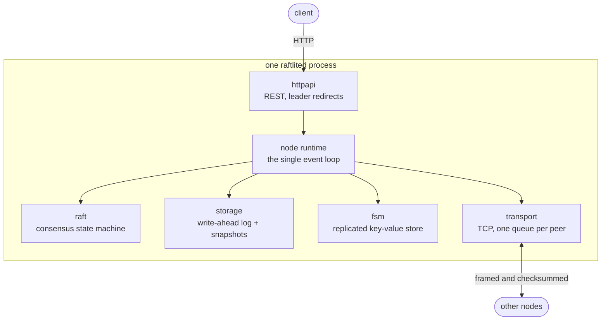

# raftlite

[](https://github.com/sahilkalgutkar/raftlite/actions/workflows/ci.yml)
[](https://codecov.io/gh/sahilkalgutkar/raftlite)
[](codecov.yml)
[](LICENSE)
[](https://go.dev/dl/)

I built the Raft consensus algorithm from scratch in Go — elections, log
replication, snapshots, dynamic membership — and put a replicated key-value
store on top of it, so the thing I wrote is a cluster you can actually run and
break rather than a paper exercise.

I had already built a single-node storage engine ([kvforge](https://github.com/sahilkalgutkar/kvforge))
and several services that assume a database stays up. This is the question those
projects let me skip: what happens when three machines have to agree, and one of
them is lying, or dead, or was unreachable for the last ten minutes and doesn't
know it yet. No `hashicorp/raft`, no `etcd/raft` — the interesting part is the
algorithm, so importing it would have left me with nothing to build.

The whole thing has **no third-party dependencies**. The wire format, the
write-ahead log, the metrics registry and the HTTP layer are all standard
library or hand-written, which keeps the parts I wanted to understand visible
instead of behind an import.

```
$ raftctl --endpoints 127.0.0.1:8001,127.0.0.1:8002,127.0.0.1:8003 status
ENDPOINT        ID  ROLE      TERM  LEADER  COMMIT  APPLIED  SNAPSHOT  KEYS
127.0.0.1:8001  1   leader    3     1       847     847      500       120
127.0.0.1:8002  2   follower  3     1       847     847      500       120
127.0.0.1:8003  3   follower  3     1       847     847      500       120
```

## What it does

A cluster of `raftlited` servers keeps a replicated key-value store. Writes go
through the log, so every node applies the same commands in the same order, and
a write that was acknowledged survives any minority of the cluster failing.

- **Leader election** with randomised timeouts, a **pre-vote** round and a
  **leader lease**, so a node that was partitioned away can't disrupt a healthy
  cluster when it comes back.
- **Log replication** with per-follower progress, quorum commit, and conflict
  hints that let a leader skip a whole stale term in one round trip.
- **Crash-safe persistence**: a checksummed write-ahead log that is fsynced
  before anything derived from it goes on the wire, and that recovers cleanly
  from a write interrupted halfway.
- **Snapshots and log compaction**, including `InstallSnapshot` for a replica
  that has fallen further behind than the leader's retained log reaches.
- **Dynamic membership**: add, promote and remove servers while the cluster
  serves. New servers join as non-voting learners so a cold replica can't stall
  writes while it catches up.
- **Linearizable reads** via the ReadIndex protocol — no log entry per read, and
  a deposed leader refuses rather than answering from stale state.
- **An HTTP API** you can drive with curl, and a `raftctl` CLI that finds the
  leader for you.
- **Prometheus metrics** at `/metrics`, including how many followers the leader
  believes are behind.

## Quickstart

### Docker

```bash
docker compose up -d --wait
./scripts/demo.sh
```

The demo brings up three nodes, writes some keys, takes a lock with
compare-and-swap, kills the leader, watches a new one take over with the
committed writes intact, and brings the old leader back to rejoin.

### From source

```bash
make build
```

Then three terminals, one per node:

```bash
./bin/raftlited --id 1 --raft-addr 127.0.0.1:9001 --http-addr 127.0.0.1:8001 \
  --data-dir data/node1 \
  --peer 1,127.0.0.1:9001,127.0.0.1:8001 \
  --peer 2,127.0.0.1:9002,127.0.0.1:8002 \
  --peer 3,127.0.0.1:9003,127.0.0.1:8003 \
  --bootstrap
```

```bash
./bin/raftlited --id 2 --raft-addr 127.0.0.1:9002 --http-addr 127.0.0.1:8002 \
  --data-dir data/node2 \
  --peer 1,127.0.0.1:9001,127.0.0.1:8001 \
  --peer 2,127.0.0.1:9002,127.0.0.1:8002 \
  --peer 3,127.0.0.1:9003,127.0.0.1:8003
```

```bash
./bin/raftlited --id 3 --raft-addr 127.0.0.1:9003 --http-addr 127.0.0.1:8003 \
  --data-dir data/node3 \
  --peer 1,127.0.0.1:9001,127.0.0.1:8001 \
  --peer 2,127.0.0.1:9002,127.0.0.1:8002 \
  --peer 3,127.0.0.1:9003,127.0.0.1:8003
```

Exactly one founding member passes `--bootstrap`; it calls the first election
instead of everyone waiting out a timeout.

A fourth server joining later needs one address, not the whole membership:

```bash
./bin/raftlited --id 4 --raft-addr 127.0.0.1:9004 --http-addr 127.0.0.1:8004 \
  --data-dir data/node4 --join 127.0.0.1:8001
```

It asks that node who is in the cluster, starts up, and announces itself as a
learner. Promote it once it has caught up:

```bash
./bin/raftctl --endpoints 127.0.0.1:8001 member-promote 4
```

## Using it

With `raftctl`:

```bash
EP=127.0.0.1:8001,127.0.0.1:8002,127.0.0.1:8003

raftctl --endpoints $EP put greeting "hello raftlite"
raftctl --endpoints $EP get greeting
raftctl --endpoints $EP --stale get greeting       # any node, possibly behind
raftctl --endpoints $EP --absent put lock held-by-a  # only if absent
raftctl --endpoints $EP --prev held-by-a put lock held-by-b
raftctl --endpoints $EP status
raftctl --endpoints $EP members
raftctl --endpoints $EP del greeting
```

Or with curl, against any node — a follower answers `307` with the leader's
address rather than proxying, so the client learns the topology:

```bash
curl -L -X PUT --data 'hello' http://127.0.0.1:8002/kv/greeting
curl http://127.0.0.1:8001/kv/greeting
curl 'http://127.0.0.1:8003/kv/greeting?consistency=stale'
curl http://127.0.0.1:8001/status
curl http://127.0.0.1:8001/metrics
```

Full endpoint reference: [docs/api.md](docs/api.md).

## How it fits together



The consensus algorithm is a pure state machine: it owns no sockets, no files
and no clock. Time arrives through `Tick`, the network through `Step`, and
everything it wants done leaves through `Ready`. The runtime is the only place
with side effects, and it performs them in the order Raft's safety argument
requires — **persist, then send, then apply**.

That split is what makes the hard part testable. Elections, log repair, snapshot
installation and membership changes are all driven from ordinary table tests
against a simulated network with no goroutines and no wall clock, so a failure
reproduces on the first try instead of one run in fifty.

Deeper: [docs/architecture.md](docs/architecture.md) ·
[docs/protocol.md](docs/protocol.md) ·
[docs/operations.md](docs/operations.md).

## Decisions I'd defend

**Pre-vote and a leader lease.** A plain implementation lets a node that was
partitioned away rejoin, bump the term, and depose a leader that was working
fine. Pre-vote makes it ask "would you vote for me?" without moving the term,
and the lease makes a node that heard from its leader recently refuse to answer
at all. There are paired tests running the identical partition with the feature
on and off: with it, the isolated node's term never moves; without it, the term
climbs without bound and the cluster is disrupted on its return.

**The no-op entry.** A new leader appends a blank entry to its own term because
committing an inherited entry on replica count alone is unsafe — section 5.4.2
of the paper. Committing one entry of the current term is what makes everything
below it safe, and it is also what makes the leader's commit index trustworthy
enough to serve a linearizable read from.

**Single-server membership changes, not joint consensus.** Any two
configurations that differ by one server share a majority, so they can never
each elect a leader in the same term. That one restriction removes the need for
joint consensus entirely. The cost is that swapping two servers takes two steps,
which I will take in exchange for a rule I can reason about.

**A best-effort transport.** Raft already assumes messages are dropped, delayed,
duplicated and reordered, and retries everything itself. So `Send` never blocks
and each peer has its own bounded queue: one unreachable follower must not be
able to stall the leader, and dropping a message it will resend anyway is far
better than applying back pressure to consensus.

**Reads default to linearizable.** A stale read is cheap and often fine, but it
should be something a caller asks for knowingly rather than discovers the first
time a follower answers with something old.

**No dependencies.** The wire codec, the WAL and the metrics registry are each
small enough that writing them was cheaper than the dependency, and they are the
parts I wanted to be able to read.

## How I tested it

Coverage is over 90%, but the number isn't the argument. Three layers are:

**A deterministic network.** The consensus package has an in-memory cluster with
fixed message ordering and controllable partitions. No sockets, no goroutines,
no clock — so an election, a split vote or a log repair plays out identically
every run.

**Real nodes on a simulated network.** The chaos suite runs genuine nodes
against real directories, writing real logs and snapshots, and asserts one
invariant: *a write that was acknowledged is never lost*. Writes that fail
during chaos aren't failures of the system — a leader dying mid-write is exactly
what the client is being told — so the invariant is only ever checked over
writes that actually returned success.

```
3363 acknowledged writes survived three leader failures
5203 acknowledged writes survived 40 rounds of random crashes, restarts,
     isolations and heals
```

**Real processes on real sockets.** The transport, the daemon and the CLI are
tested against loopback listeners, and the demo runs three containers through a
leader failure.

That last layer earned its place twice. Both of these passed every in-process
test and failed the moment two machines had to talk:

- **A field missing from the codec.** The read identifier was threaded through
  the algorithm but never encoded, so linearizable reads timed out over TCP and
  worked everywhere else. Fixed, plus a reflection test that fails if any
  message field is left out of the codec, and a linearizable read exercised over
  real sockets.
- **A snapshot treated as reliable.** A lost `InstallSnapshot` left the leader
  waiting for an acknowledgement forever while refusing to send that follower
  anything else — stranding it permanently. An unacknowledged snapshot now
  expires and is resent.

## Configuration

| Flag | Default | What it does |
| --- | --- | --- |
| `--id` | required | This server's unique id |
| `--raft-addr` | `127.0.0.1:9001` | Address peers connect to |
| `--http-addr` | `127.0.0.1:8001` | Address clients connect to |
| `--data-dir` | `data/node<id>` | Where the log and snapshots live |
| `--peer` | — | `id,raft-addr,http-addr`, repeated per member |
| `--bootstrap` | `false` | Call the first election; one founding member sets it |
| `--join` | — | HTTP address of any member of an existing cluster |
| `--tick-interval` | `100ms` | Logical clock period |
| `--election-ticks` | `10` | Ticks without a leader before campaigning |
| `--heartbeat-ticks` | `1` | Ticks between leader heartbeats |
| `--snapshot-threshold` | `1000` | Applied entries between snapshots |
| `--request-timeout` | `5s` | How long an API request may wait on consensus |
| `--unsafe-no-fsync` | `false` | Skip fsync — fast, and not crash safe |
| `--log-level` | `info` | `debug`, `info`, `warn` or `error` |

An election timeout is `election-ticks × tick-interval` at the low end, and each
node randomises its own within `[t, 2t)` so a split vote resolves instead of
repeating. The defaults give a one to two second failover.

## Project layout

| Package | What lives there |
| --- | --- |
| `internal/raft` | The algorithm. No I/O, no clock, no locks. |
| `internal/storage` | Write-ahead log, snapshot files, crash recovery. |
| `internal/wire` | Binary codec and framing, shared by disk and network. |
| `internal/transport` | TCP transport, plus an in-memory mesh for tests. |
| `internal/fsm` | The replicated key-value state machine. |
| `internal/node` | The event loop that ties all of the above together. |
| `internal/httpapi` | Client-facing REST API. |
| `internal/server` | Daemon wiring, join flow, lifecycle. |
| `internal/cli` | `raftctl`. |
| `internal/metrics` | Prometheus text format registry. |
| `internal/chaos` | Cluster-level failure tests. |
| `cmd/raftlited`, `cmd/raftctl` | The two binaries. |

## Development

```bash
make test     # everything, with the race detector
make cover    # coverage across packages
make chaos    # just the cluster failure tests, verbosely
make lint     # gofmt and go vet
make up       # three nodes in Docker
make demo     # the failover walkthrough
```

## What I'd add next

The state machine is a key-value map because the interesting part was
underneath it; a real workload would want ranges, watches and TTLs. There is no
transport security — a production deployment would need mutual TLS between
peers. Leadership transfer (`TimeoutNow`) would turn a rolling restart from an
election into a handoff. And the linearizable read path confirms leadership per
read rather than batching concurrent reads behind one heartbeat round, which is
the obvious next optimisation.

## License

[MIT](LICENSE)
