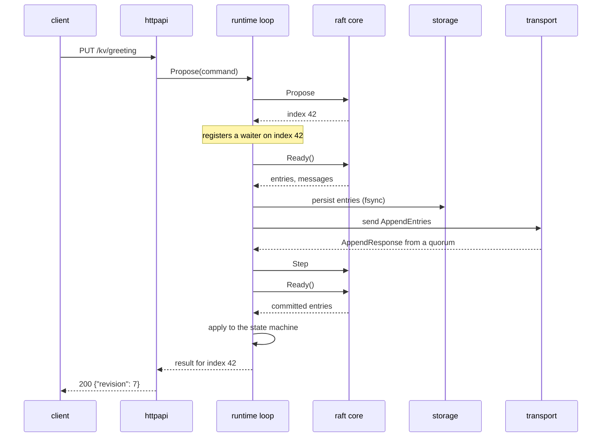

# Architecture

This is the longer version of the diagram in the README: what each layer owns,
why the boundaries fall where they do, and the handful of orderings that are
load-bearing for correctness rather than tidiness.

## The shape of a node

The client's request never touches the consensus state machine directly. It
becomes a proposal on a channel, the loop picks it up, and the answer comes back
only once the entry has committed and applied.

## Why the algorithm has no I/O

`internal/raft` has no sockets, no files, no clock and no locks. Time arrives
through `Tick`, messages through `Step`, and everything it wants done leaves
through `Ready`.

That is not architectural taste. Consensus bugs are rare-interleaving bugs — a
vote that arrives after a term change, an append that lands during a snapshot,
a commit index that advances while a configuration is halfway applied. Testing
those against real sockets means hoping the scheduler produces the interleaving
you need. Testing them against a state machine you drive by hand means writing
the interleaving down.

So the consensus tests are ordinary table tests plus an in-memory network with
fixed delivery order, and every one of them is deterministic.

## The ordering that matters

`drainReady` in `internal/node/loop.go` does four things in a fixed order:

1. **Install any snapshot** the leader sent.
2. **Persist** the hard state and new entries, and fsync.
3. **Send** the outbound messages.
4. **Apply** the newly committed entries.

Steps 2 and 3 cannot be swapped. Raft's safety proof assumes a node remembers
its vote and its log across a crash. A node that sends a vote and then dies
before the vote reaches its disk can wake up and vote again in the same term —
two leaders, one term, and a committed entry can be lost. The same applies to an
acknowledged append: acknowledge, crash, and deny holding it, and a leader may
count a replica that does not exist.

Step 4 comes last because applying an entry is irreversible from the state
machine's point of view. Only entries a quorum has committed reach it.

There is a fifth ordering, less dramatic but real: **client replies are held
until the node has republished its status snapshot.** Otherwise a caller that
adds a member and immediately reads the member list can be shown a view that
predates its own change.

## Storage

The write-ahead log is a sequence of framed, checksummed records: a hard state,
an entry, or a truncation.

Truncation needs its own record type because the log is append-only. When a
follower's diverged tail is replaced, those entries are already in the file, so
their *removal* has to be recorded as an event rather than by rewriting history.

Recovery assumes the last write was interrupted, because eventually it was.
Replay stops at the first record that fails its checksum and reports the offset
before it; `Open` truncates the file there. Without that truncation the next
append lands behind garbage and is unreachable on the following restart.

Snapshots are written to a temporary name, fsynced, renamed into place, and the
containing directory is fsynced too — a rename is not durable until the
directory entry is. The image lands **before** the log is compacted behind it: a
crash between the two costs some redundant replay, while the reverse order loses
entries permanently. Three images are kept, so a snapshot that was mid-write
during a crash costs a little replay rather than all durable state.

## Transport

One listener, one outbound connection per peer, one goroutine and one bounded
queue each.

Connections are one-directional on purpose: a node dials its peers to send and
only reads from connections it accepts. Two nodes hold two connections rather
than negotiating one, which costs a socket and saves an entire handshake
protocol with its own tie-break rules and failure modes.

`Send` never blocks and never reports delivery. Raft retries on its own
schedule, so dropping a message from a full queue is strictly better than
letting one slow peer stall the leader's event loop.

## The state machine

An ordinary map with a revision counter, plus compare-and-swap so clients can
build locks, leases and counters on top without the state machine knowing about
any of them.

The only real constraint is determinism. Every replica applies the same entries
in the same order, so applying them has to produce identical state. Two
consequences that are easy to get wrong:

- A delete of a key that is not there does **not** move the revision. If it did,
  a replica that happened to receive a redundant delete would report a different
  revision for identical contents.
- Snapshots encode keys in sorted order. Go randomises map iteration, so
  encoding in map order gives two replicas byte-different images of the same
  state, which turns "did these nodes agree?" from a byte comparison into a
  semantic diff.

A command that fails to decode is recorded as a failed result rather than
skipped, because every replica decodes the same bytes and so has to reach the
same conclusion.

## Failure behaviour

| Failure | What happens |
| --- | --- |
| A follower dies | Leader keeps committing; the follower is caught up with entries, or a snapshot if it fell behind the retained log |
| The leader dies | A follower times out, campaigns, and wins within one to two election timeouts; acknowledged writes are all present |
| The leader is partitioned | It stops hearing from a quorum, steps down, and refuses linearizable reads; the majority elects a replacement |
| A minority is partitioned | It cannot commit anything and cannot elect anyone; on healing it adopts the majority's log |
| Every node dies | Each recovers its log from disk; nothing acknowledged is lost |
| A disk write fails | The node stops. Serving after a failed write means answering from state it cannot promise to remember |

## Sizing

An election timeout is `election-ticks × tick-interval`, randomised per node
within `[t, 2t)`. The default of 10 ticks at 100ms gives failover in one to two
seconds. Lower it for faster failover and more spurious elections on a lossy
network; raise it for the opposite.

Appends carry at most 64 entries per message, so a follower returning from a
long outage streams its backlog rather than asking the leader to build one
enormous message.
